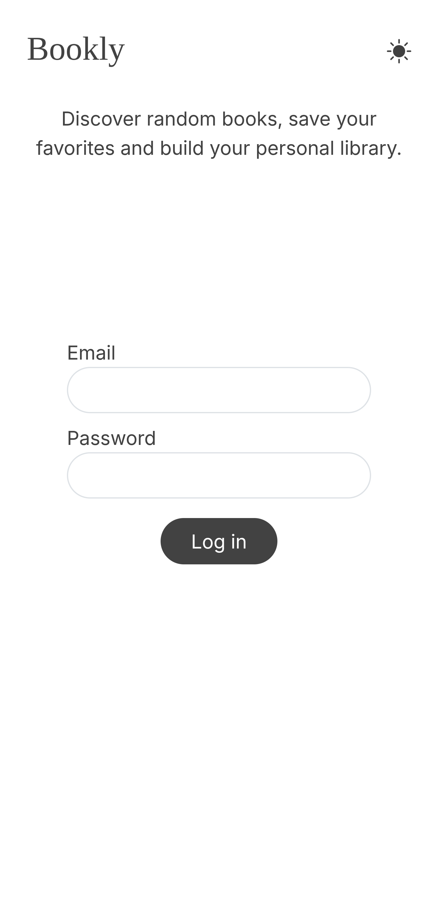
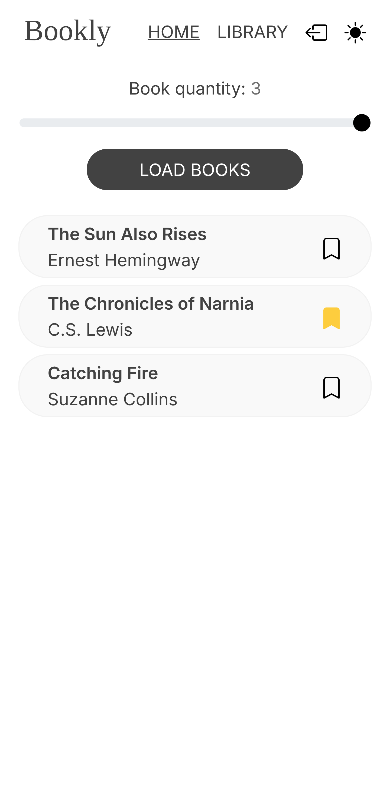
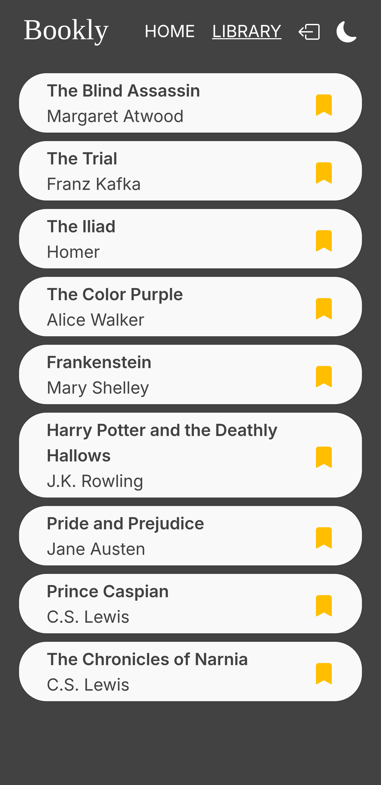
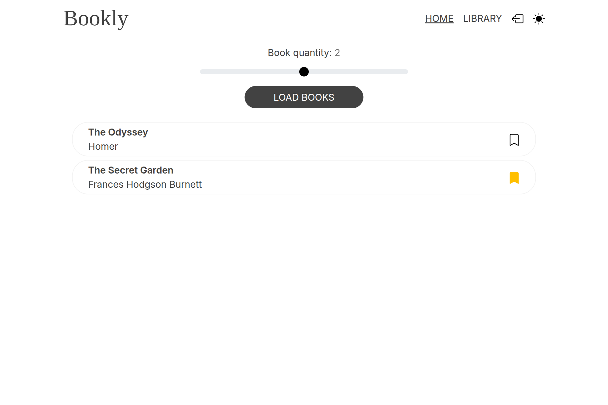

# [Bookly - Live Demo](https://bookly-mateo.netlify.app/)

A responsive React application that allows authenticated users to fetch random books from an API and save them to their personal library. The app includes dark/light mode and is styled using Bootstrap.

## Tech Stack

- Frontend: React, Vite
- Authentication: JWT
- Libraries: React Router
- Styling: CSS, Bootstrap

## Preview

<kbd></kbd>
<kbd></kbd>
<kbd></kbd>

<kbd></kbd>

